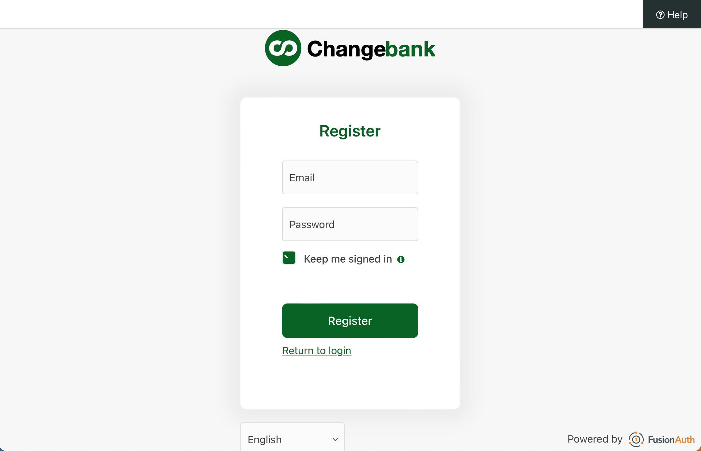

# What is a Quickstart?
A quickstart is a guide that takes a user through a simple OAuth auth code grant integration with FusionAuth. 
* It's specific to a language or framework
* It uses an off-the-shelf library, SDK, or built-in support for doing the OAuth interactions
* It has a companion example app
* It's bundled with a FusionAuth docker-compose file, and a kickstart file that gets FusionAuth set up to work with the given tech stack

# Example App
An example app is a companion to a Quickstart, providing the basic setup for going through the Quickstart. Each example app will implement the Change Bank application, described below.

## Example App Contents

| Item | Description |
| --- | --- |
| README.md | A description of the project, and how to run it |
| docker-compose.yml | A docker-compose config for starting FusionAuth |
| kickstart/ | A directory containing a kickstart file for configuring FusionAuth |
| stub-application/ | A directory containing a stubbed out app that a user can use with the quickstart documentation. This application will contain the Change Bank web pages, and will just be lacking implementations of the FusionAuth integration |
| complete-application/ | A directory containing a fully working example application, which represents the end result of following the quickstart |

## Creating an Example App
To create an example app, copy the files from this repository to a new repo. Use a repo name of `fusionauth-quickstart-{web,api}-TECHSTACK` where 
`TECHSTACK` describes the language and/or framework being demonstrated in the example app.

## Bundled FusionAuth
Each example app contains a docker-compose.yml and a kickstart file that together stand up an instance of FusionAuth with an Application configured to work with the technology or framework that is being showcased in the Quickstart. This means using the standard port(s) and path(s) for the various OAuth handoffs.

## Change Bank Application
The Change Bank application will have the following. Note that the screenshots were taken from the [FusionAuth example react app](https://github.com/FusionAuth/fusionauth-example-react-sdk).

### Home Page
The home page represents the logged-out view for a user. The home page has
  * A login button that takes the user to FusionAuth's /oauth2/authorize endpoint with the necessary parameters
  * A register button that takes the user to FusionAuth's /oauth2/register for self-service registration

### Styled Login Page
The login page is hosted by FusionAuth, but should be styled to look like a Changebank page. After a successful login, the user is taken to the application page.

### Styled Registration Page
The registration page is hosted by FusionAuth, but should be styled to look like a Changebank page. After a successful registration, the user is taken to the application page.

### Application Page
The application page represents the logged in view for a user. This page will contain a logout button that takes the user to FusionAuth's /oauth2/logout endpoint

### Back End Endpoints / Routes
The application back end will need the following

| Path | Password-protected? | Description |
| --- | --- | --- |
| / | No | The application home page (logged-out view) |
| /callback | No | The OAuth redirect URI, where a user is redirected after successfully logging in at FusionAuth. This endpoint performs the token exchange with FusionAuth to obtain the access token, refresh token, and id token for the user. It writes these tokens as cookies. |
| /login | No | Constructs the OAuth authorize call, and redirects the user to FusionAuth's `/oauth2/authorize` endpoint |
| /logout | Yes | Deletes the user's cookies and redirects to `/` |
| /account | Yes | Takes the user to their bank account page. This page needs to be protected, so that a user needs to prove who they are before accessing a bank account. |

### Protected Endpoints
The `/account` and `/logout` endpoints need to be protected. `/account` provides access to a bank customer's bank account, so access needs to be 
authorized. It's good practice to also secure `/logout`, since a CSRF attack could be used to force a user to unwittingly log out of the application.

The following logic needs to be applied. This is best delivered as a function annotation or routing middleware, so that it can be easily applied to 
many endpoints without a lot of copying of code and logic.

* Is an access token present?
  * If the access token is present, is it valid (does the signature check out)?
    * If the access token's signature is valid
      * Is the access token active (not expired)?
        * If the access token is not expired, allow the request to proceed
        * If the access token is expired, is a refresh token present?
          * If a refresh token is present, attempt to refresh the access token
            * If the refresh succeeds, allow the request to proceed
            * If the refresh fails, redirect the user to `/login'
          * If no refresh token is present, redirect the user to `/login`
    * If the access token's signature is not valid
      * Delete the user's cookies
      * Redirect the user to `/login`
  * If no access token is present, is a refresh token present?
    * If a refresh token is present, attempt to refresh the access token
      * If the refresh succeeds, allow the request to proceed
      * If the refresh fails, redirect the user to `/login`
    * If no refresh token is present, redirect the user to `/login`
