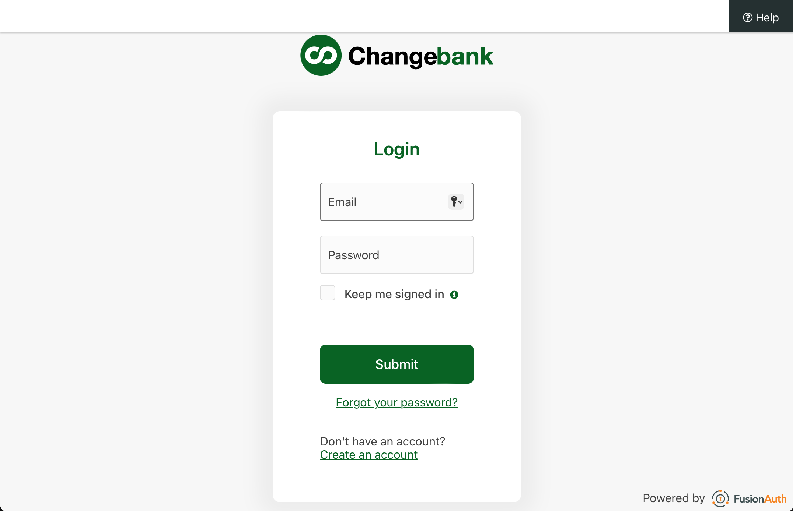

# What is a Quickstart?
A quickstart is a guide that takes a user through a simple OAuth auth code grant integration with FusionAuth. 
* It's specific to a language or framework
* It uses an off-the-shelf library, SDK, or built-in support for doing the OAuth interactions
* It has a companion example app
* It's bundled with a FusionAuth docker-compose file, and a kickstart file that gets FusionAuth set up to work with the given tech stack

# Example App
An example app is a companion to a Quickstart, providing the basic setup for going through the Quickstart. Each example app will implement the Change Bank application, described below.

Each example app repo contains
* A docker-compose.yml file for standing up FusionAuth.
* A stubbed-out application that can be integrated with FusionAuth, using the Quickstart as a guide. This stubbed-out application will contain the Change Bank web pages, and will just be lacking implementations of the OAuth-related back end endpoints.
* A fully working application integration with FusionAuth. This is useful if you want to start with a working integration and build out from there, or if you want to see what the end result of the Quickstart is.

## Bundled FusionAuth
Each example app contains a docker-compose.yml and a kickstart file that together stand up an instance of FusionAuth with an Application configured to work with the technology or framework that is being showcased in the Quickstart. This means using the standard port(s) and path(s) for the various OAuth handoffs.

## Change Bank Application
The Change Bank application will have the following. Note that the screenshots were taken from the [FusionAuth example react app](https://github.com/FusionAuth/fusionauth-example-react-sdk).

### Home Page
The home page represents the logged-out view for a user. The home page has
  * A login button that takes the user to FusionAuth's /oauth2/authorize endpoint with the necessary parameters
  * A register button that takes the user to FusionAuth's /oauth2/register for self-service registration

### Styled Login Page
The login page is hosted by FusionAuth, but should be styled to look like a Changebank page. After a successful login, the user is taken to the application page.

### Styled Registration Page
The registration page is hosted by FusionAuth, but should be styled to look like a Changebank page. After a successful registration, the user is taken to the application page.

### Application Page
The application page represents the logged in view for a user. This page will contain a logout button that takes the user to FusionAuth's /oauth2/logout endpoint

### Back End Endpoints
The application back end will need the following
* An endpoint for the redirect URI registered with the FusionAuth Application, which performs the token exchange, and writes access token and refresh token cookies
* An endpoint that FusionAuth will redirect the user to after logout. This endpoint will take the user to the home page
